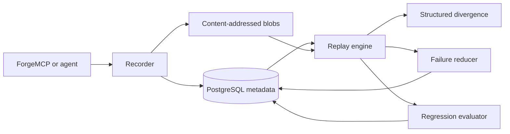

# ReplayScope

[](https://github.com/Tz22z/ReplayScope/actions/workflows/ci.yml)

Replay and regression diagnosis for AI agents. ReplayScope records model boundaries, tool calls,
errors, environment metadata, and content-addressed workspace deltas; then it deterministically
replays traces, pinpoints structured divergence, and minimizes stable failures.

## Verified results

The committed output from `scripts/validate_claims.py` contains three reproducible, deterministic
experiments with injected ground truth:

| Experiment | Result |
|---|---|
| Fresh-model replay | 240 traces; all 15 injected drifts found; 100% precision/recall |
| Failure reduction | 26/30 stable faults reproduced; 83.33% mean reduction; 0 false results |
| Regression evaluation | 100 cases × 5 repeats; 82% solve rate; 2.28-point score stddev |

The validation run finishes in under two seconds because adapters are local deterministic fixtures.
It validates ReplayScope's detection, reduction, and aggregation mechanics; it does not estimate a
natural production drift rate or live-model quality. The JSON includes per-case records, a confusion
matrix, source/runner hashes, and machine-checked assertions.

## Architecture



PostgreSQL stores trace order, hash-chain heads, replay results, reduction trials, and evaluation
observations. Large payloads and workspace contents live in an atomic filesystem CAS and are
referenced by SHA-256. Trace events are immutable and each hash includes the previous event hash.

## Capture

```python
from pathlib import Path

from replayscope.cas import LocalCAS
from replayscope.models import TraceStatus
from replayscope.recorder import Recorder
from replayscope.repository import MemoryTraceRepository

repository = MemoryTraceRepository()  # use PostgresTraceRepository in production
recorder = Recorder(repository, LocalCAS(Path(".replayscope/cas")))
trace = recorder.start("run-42", framework="forgemcp", workspace=Path("./workspace"))

response = recorder.record_model_call(
    trace.id, "planner", {"messages": []}, lambda: model.complete(...), model="model-v2"
)
result = recorder.record_tool_call(
    trace.id,
    "logs.search",
    {"query": response["query"]},
    lambda: tools.search(response["query"]),
    tool_version="3",
)
recorder.finish(trace.id, status=TraceStatus.SUCCEEDED, workspace=Path("./workspace"))
```

The ForgeMCP adapter wraps the same boundaries without modifying framework internals. Keys such as
authorization, token, secret, cookie, password, and API key are recursively redacted before storage.

## Replay modes

| Mode | Model calls | Tool calls | Workspace behavior |
|---|---|---|---|
| `recorded` | recorded output | recorded output | restore recorded deltas |
| `fresh_model` | execute adapter | recorded output | restore recorded tool deltas |
| `fresh_all` | execute adapter | execute adapter | compare actual vs recorded deltas |

Every replay validates the complete event hash chain before running. JSON results are compared by
path with configurable ignored fields and numeric tolerance. Error signatures and workspace
manifests have dedicated divergence types; missing adapters are explicit errors.

## Failure reduction

The reducer uses `ddmin` across input fields, recorded tool returns, and workspace files. Every
candidate starts from a newly restored CAS manifest. A candidate only reproduces when all stability
runs return the original normalized failure signature; flaky baselines are `inconclusive`.

## Regression evaluation

Evaluation variants pin model name, prompt version, and context policy. A suite runs each trace five
times by default and reports solve rate, weighted score, repeat variance, total cost, and p95 latency.
Every observation and its replay ID can be persisted to PostgreSQL.

## Quick start

```bash
docker compose up -d --build postgres migrate --wait
docker compose --profile tools run --rm cli record-demo
docker compose --profile tools run --rm cli inspect TRACE_ID
docker compose --profile tools run --rm cli replay TRACE_ID --mode fresh_model --drift
```

Local validation:

```bash
python -m venv .venv
.venv/bin/pip install -e '.[dev]'
make lint test integration
.venv/bin/python scripts/validate_claims.py
```

## Guarantees and boundaries

- Concurrent event append is serialized by a PostgreSQL trace row lock.
- CAS writes use fsync plus atomic rename; every read rehashes content.
- Workspace restoration rejects absolute paths, traversal, and escaping symlinks.
- `recorded` replay performs no model or tool I/O.
- Fresh replay is deterministic only to the extent that adapters pin their external environment.
- Replaying side-effecting tools is opt-in; adapters should use sandboxes or idempotency controls.

See `docs/architecture.md`, `docs/replay-semantics.md`, and `docs/operations.md`.

## License

MIT
